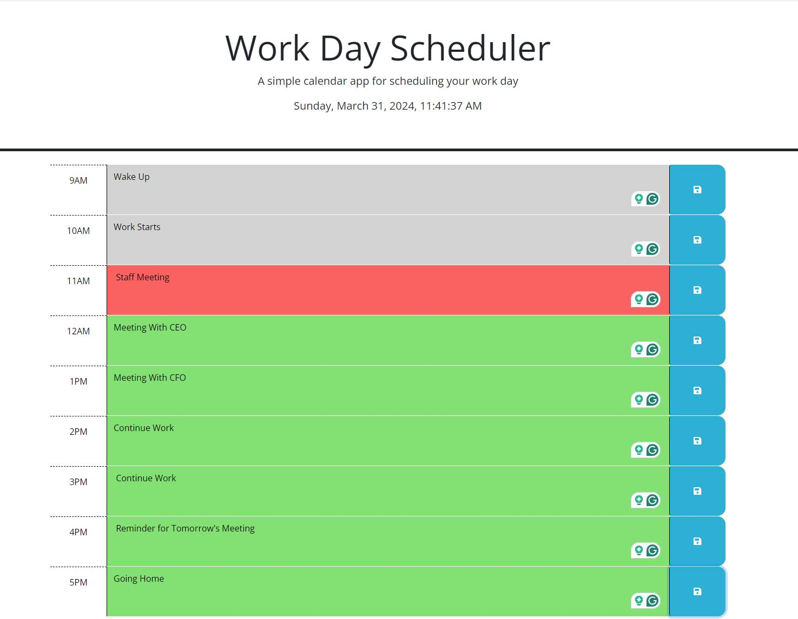

This application requires HTML, CSS, and JavaScript to run properly.

Initial Display: 

Upon the initial page load, the current time is displayed.
Time Blocks: The page presents time blocks representing standard business hours from 9am to 5pm.
Color Coding: Each time block is color-coded to indicate whether it is in the past, present, or future. This is determined by comparing the hour extracted from the time block ID (e.g., 'hour-13') with the current hour obtained using the Day.js library.
If the current hour is greater than the hour of the time block, it is marked as "past."
If the current hour matches the hour of the time block, it is marked as "present."
If the current hour is less than the hour of the time block, it is marked as "future."

Data Persistence:

Local Storage: Existing data from previous sessions is retrieved from local storage.
Rendering: If data exists in local storage, it is populated into the corresponding time blocks.
User Input:

Saving Events:

When a user clicks into a time block and enters an event, they can save it by clicking the save icon.
Updating Local Storage: If the time block's content ID exists in local storage, the saved event is updated; otherwise, a new record is created.
Immediate Update: Upon saving, the rendering() function is activated to update the changes to the time block.
Persistent Events: Even after the page is refreshed, the saved events persist due to the data being stored in local storage.
This approach ensures that the application provides a seamless user experience with persistent data storage and real-time updates.

Live Site Link

